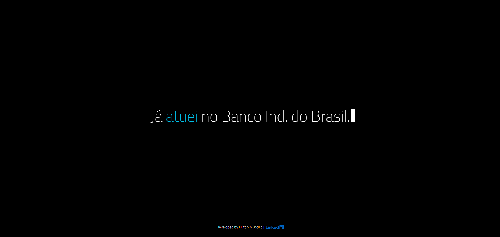

# Typed.js Custom Effect – Hilton Muccillo

[Demo Online](https://hiltonmuccillo.com/typed/) | [CodePen](https://codepen.io/hiltonmuccillo/pen/OJNRLdO)

Um **efeito de digitação customizado em JavaScript** criado para exibir mensagens sequenciais de forma animada, com **alteração de cores** e efeito de cursor piscante. Ideal para portfólios, apresentações ou landing pages dinâmicas.

---

## Features

- Animação de digitação **tipo “typed”** totalmente customizada.
- **Mensagens sequenciais**, trocando automaticamente a cada 6 segundos.
- **Cores dinâmicas**: verde, amarelo e azul, alternando a cada ciclo de 60 segundos.
- Cursor piscante para efeito realista de digitação.
- **Responsivo**: funciona em telas de qualquer tamanho.
- **Fácil integração**: apenas HTML, CSS e JS puro – sem dependências externas.

---

## Demonstração

Veja o efeito em ação:

[](https://hiltonmuccillo.com/typed/)  
[Link para Demo](https://hiltonmuccillo.com/typed/)  
[Link no CodePen](https://codepen.io/hiltonmuccillo/pen/OJNRLdO)

---

## Como usar

### 1. HTML

Adicione um container para o efeito:

```html
<div id="typed"></div>
